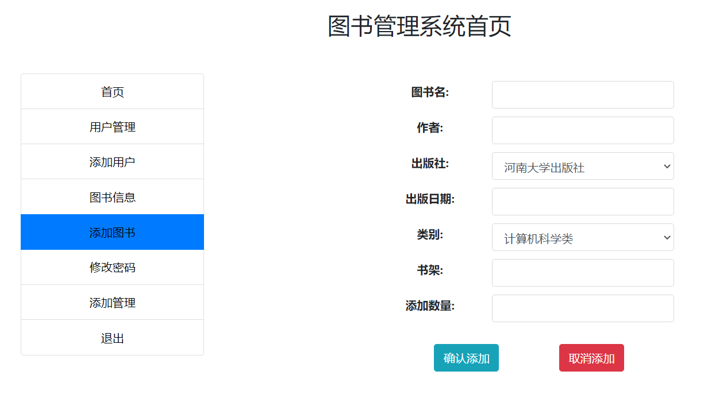
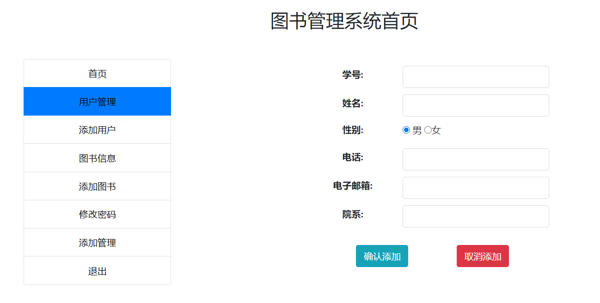
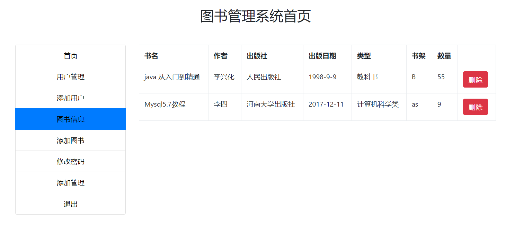

<h1 align="center">基于JSP+Servlet实现的图书管理系统</h1>

 获取sql文件 QQ: 3645296857 QQ群: 978300347 

<h4> 需要视频演示可联系上述QQ，私发视频链接 </h4>

 获取更多高质量源码，请访问：[mzoo源码网](https://mzoocodes.com/)

## 简介

> 本代码来源于网络,仅供学习参考使用!
>
> <b style="color: dodgerblue"> 提供1.远程部署/2.修改代码/3.定制程序/4.文档指导/5.框架代码讲解、技术解答、代码讲解等服务 </b>
>
> 前端登录地址：http://localhost:8080/mainLogin.jsp
> 
> 管理员: admin 密码: ff0ad942f3afc7a5
> 
> 用户: 1510121026 密码: ymkz
>

## 项目介绍

基于JSP+Servlet实现的图书管理系统：前端 JSP、BootStrap、JQuery、Ajax，后端 Servlet、JDBC，系统角色分为：管理员和用户。管理员在管理端对系统用户进行管理，可以发布图书信息等；用户可以对书籍进行借阅，归还等。主要功能如下：

### 管理员

- 基本操作：登录、修改密码、登出、添加管理员
- 用户管理：管理员可以查看用户列表、编辑用户信息、删除用户、查看用户信息详情、添加用户信息
- 图书管理：管理员可以添加、删除图书信息，包括图书封面、作者、出版社、ISBN号、简介等。

### 用户

- 基本操作：登录、修改密码、登出、注册
- 图书模块：借书、获取借阅列表、还书

## 环境

- <b>IntelliJ IDEA 2020.3</b>

- <b>Mysql 5.7.26</b>

- <b>Tomcat 9.0.41</b>

- <b>JDK 1.8</b>

## 运行截图

